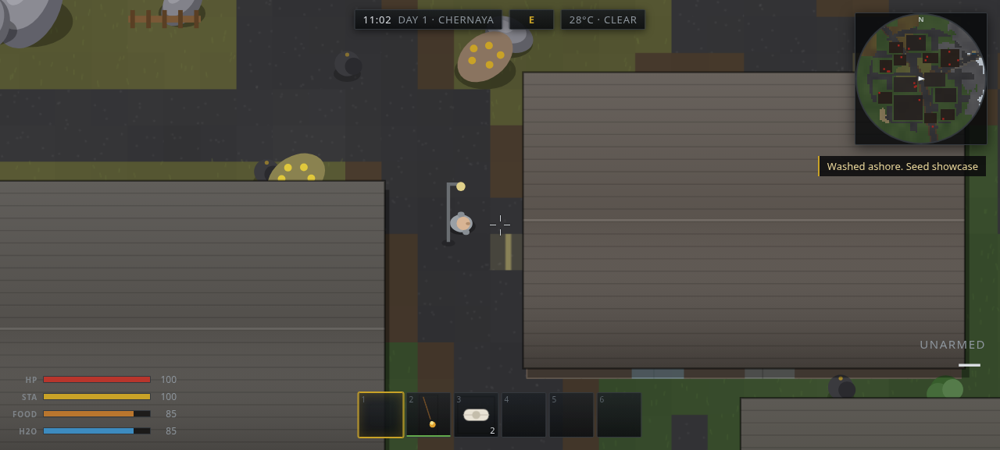
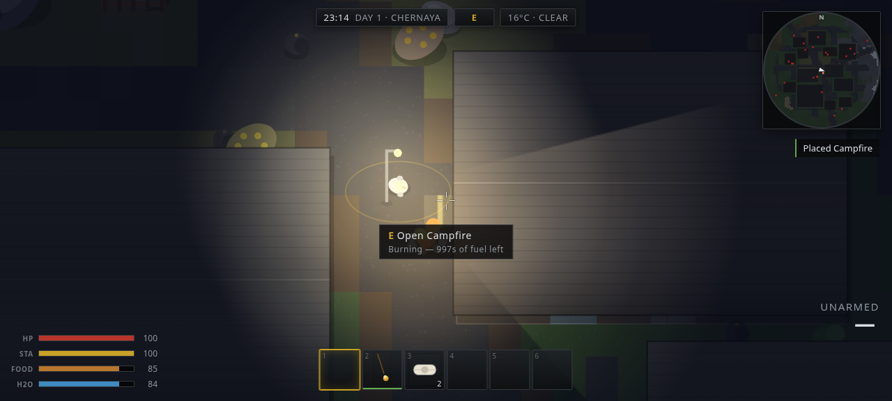
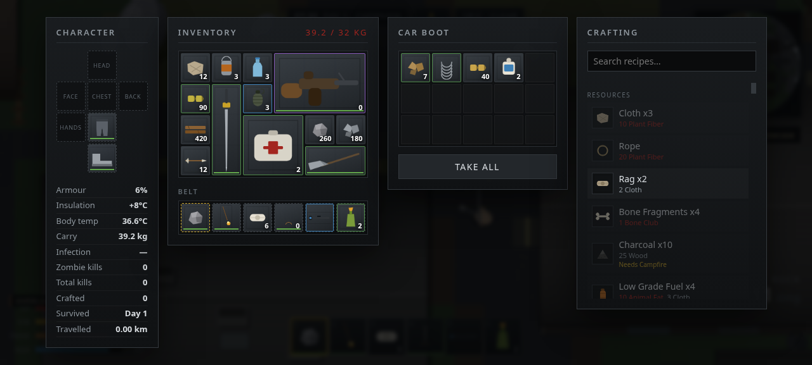
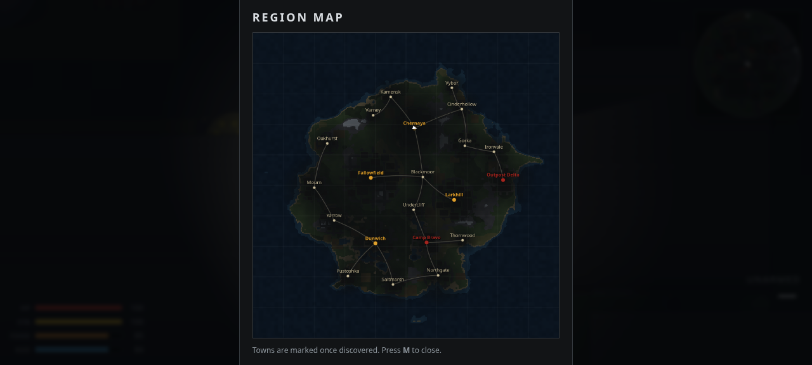

# WASTELAND

A Rust + DayZ inspired top-down survival sandbox that runs entirely in a browser
tab. Procedurally generated island, enterable buildings full of loot, spatial
grid inventory, ~150 items, zombies that hunt you harder after dark, armed
bandits, rideable horses, crafting tiers and base building.

No art or audio assets: every sprite, item icon and sound effect is generated at
runtime from canvas primitives and WebAudio.

| | |
| --- | --- |
|  |  |
| Towns are laid out building-first, with roads routed around them. Roofs hide their interiors until you step inside. | After dark the temperature drops and zombies get faster and more numerous. Your flashlight is also a beacon. |
|  |  |
| Spatial grid inventory, side-by-side looting, and crafting gated by nearby stations. | 21 settlements on a seeded island, linked by a minimum-spanning-tree road network. |

## Running it

```bash
cd wasteland         # this project lives in a subdirectory of the repo
npm install
npm run dev          # http://localhost:5173
```

Or build a **single self-contained HTML file** you can double-click or host
anywhere (all JS, CSS and generated art inlined — no server needed):

```bash
npm run build        # -> dist/index.html  (~322 KB, ~99 KB gzipped)
```

## Controls

| Input | Action |
| --- | --- |
| `WASD` | Move |
| `Shift` | Sprint (drains stamina; gallop while mounted) |
| `Ctrl` | Crouch — quieter, harder to spot, steadier aim |
| Mouse | Aim |
| `LMB` | Fire / swing / throw (hold to charge a bow) |
| `RMB` | Aim down sights — much tighter spread |
| `R` | Reload (also rotates a dragged item, and cycles build pieces) |
| `G` | Throw the held throwable |
| `E` | Contextual interact: loot, skin, light, mount, drink, pick up |
| `Tab` | Inventory / crafting |
| `1`–`6`, wheel | Belt slots |
| `Q` | Holster |
| `F` | Flashlight |
| `H` | Quick-heal (bandage if bleeding, best available otherwise) |
| `B` | Build mode (needs a Building Plan) — wheel changes piece |
| `Space` | Mount / dismount a saddled horse |
| `M` | Region map |
| `P` | Mute |
| `Esc` | Pause |

**Inventory:** drag items between the grid, belt and equipment slots. `Shift+LMB`
transfers to/from an open container, `RMB` performs the item's natural action
(wear / eat / deploy / fit attachment / move to belt), `MMB` splits a stack, `R`
rotates while dragging, and dropping outside the window throws it on the ground.

## What's in it

**World** — A 400×400-tile island (12,800 units square) generated from a seed:
fbm terrain with a ridged mountain spine, rivers carved by steepest descent, 7
biomes, and 21 settlements (city, towns, villages, hamlets, farms, fuel-stop
outposts and two high-tier military bases) linked by a minimum-spanning-tree road
network. Every settlement lays its buildings out first, then routes streets
around them. ~150 buildings per world, each with BSP-partitioned rooms, doorways,
windows you can shoot through but not walk through, and role-appropriate
furniture that doubles as its loot containers (~680 per world). Roofs vanish when
you step inside.

**Survival** — Health, stamina, hunger, thirst, core body temperature, wetness,
bleeding, infection from bites, broken legs, painkillers, and a carry-weight
limit. Night drops the temperature and makes zombies faster, more numerous and
more aggressive; day 1 is very different from day 12.

**Inventory** — Rust-style spatial grid: a 3×2 assault rifle really does occupy
six cells, a machete stands 1×3, and backpacks add rows. Six belt slots feed the
hotbar. Stacks split at their per-item limits and items track durability,
loaded magazine and fitted attachments individually.

**Weapons** — 17 firearms from a hunting bow up to an LMG and a rocket launcher,
across 9 ammo calibres, with simulated projectiles (lead your targets), per-gun
spread/recoil/RPM, bolt and pump cycling, single-round reloads, and 5 attachments
(scope, silencer, laser, muzzle brake, weapon light). 20 melee weapons with real
swing arcs, cleave, bleed and gathering power. 7 throwables: frag, beancan,
molotov (leaves a burning pool), smoke, flashbang, satchel charge, throwing
knives — plus spears you can hurl and pick back up.

**Enemies** — 6 zombie archetypes (walker, runner, crawler, screamer that calls
the horde, bloater that ruptures on death, brute) with a full sense→investigate→
chase→attack state machine driven by sight lines and noise. Gunfire carries much
further than footsteps; a silencer is worth finding. 4 bandit types that take
cover distance, strafe, burst-fire, flee when hurt and shoot zombies too. Deer,
boar, wolf packs and chickens. Night hordes converge from one direction.

**Horses** — Wild herds bolt if you sprint at them. Crouch nearby to build trust,
fit a saddle to tame one, then mount it for a 400 u/s gallop with its own stamina
pool and 24 slots of saddle bags.

**Crafting** — 120 recipes gated by station rather than an XP tree: whittle a
spear anywhere, but an AK needs a level 3 workbench, which needs a level 2's
worth of resources to build. Queue with up-front material cost and full refund on
cancel. Campfires cook and boil water, furnaces smelt ore.

**Building** — 96-unit foundation grid with walls, doorways, fitted doors and
floors, upgraded in place through twig → wood → stone → sheet metal. Structures
have hit points and can be blown open.

Plus: day/night with a moon cycle, 5 weather states with wind-driven rain and
lightning, dynamic lighting with flashlight cones and firelight, night-vision
goggles, blood decals, a minimap, a fog-of-war region map, and autosaving to
localStorage.

## Architecture

```
src/
  core/      loop (fixed timestep) · input · math · seeded rng+noise ·
             spatial hash · procedural WebAudio synth
  world/     worldgen · runtime world (collision, raycasts, structures) ·
             BSP building interiors · props · tiles · day/night & weather
  items/     item database · procedural icon renderer · grid container ·
             loot tables · recipes
  entities/  actor base · player · zombie · bandit · animal · horse ·
             projectiles & area effects · corpses
  systems/   combat · crafting · building · interaction · spawner · save
  render/    draw pipeline · procedural sprites · particles & decals
  ui/        HUD · inventory/crafting screen · styles
  game.ts    orchestration; `simulate(dt)` is the headless simulation step
```

Design notes worth knowing:

- **Determinism.** Terrain, town layout and prop placement come from the seed
  alone. Saves store only mutable state (player, looted containers, harvested
  nodes, built structures, time) and regenerate the world on load.
- **Lazy loot.** Container contents are rolled the first time you open them, from
  a per-container seed, so ~680 containers cost nothing until used.
- **Terrain caching.** Ground is baked into 512×512 chunk canvases with an LRU
  cache, so the detailed per-tile texturing is paid once.
- **Draw order.** Terrain → decals → floors → depth-sorted entities → roofs →
  particles → lighting → weather. Roofs are drawn after entities, which is what
  hides the contents of buildings you're not inside.

## Tests

A headless functional harness drives the real systems — not mocks — against a
generated world:

```bash
npm run build:harness      # bundles to test/dist/harness.html
# then open test/dist/harness.html in a browser; results render on the page
```

44 checks covering worldgen determinism and content, harvesting and tool
matching, ballistics and wall occlusion, melee arcs, looting, crafting and
station gating, building placement/upgrade/destruction, deployables, horse
taming and riding, explosive falloff, zombie and bandit AI, survival meters,
armour mitigation, grid packing/rotation/stacking, save round-tripping, and a
performance floor.

The harness earned its keep — it caught seven real bugs, including a town layout
that made the city generate zero buildings, a container that silently dropped
items when stacking past a stack limit, walkable-foundation collision, and a
stale spatial hash that made freshly spawned enemies immune to bullets.
